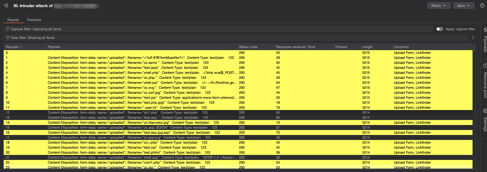
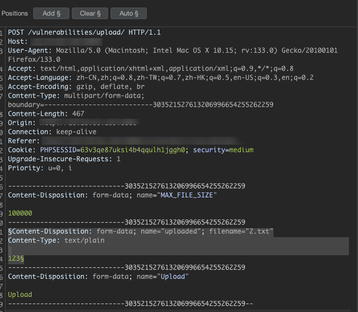
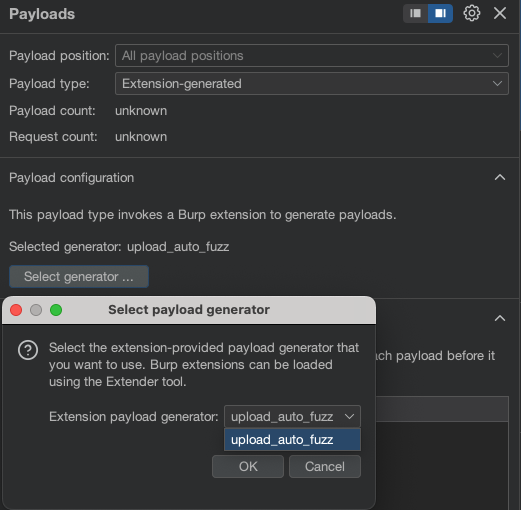

# Upload_Auto_Fuzz - Burp Suite 文件上传漏洞Fuzz插件


## 版本更新

### v1.1.0

- **新增功能**：
  - 添加云环境绕过模块，支持对象存储、容器化环境和Serverless特性绕过
  - 添加高级防御绕过模块，针对AI分析引擎和行为沙箱系统
  - 增强特性：字符变异、数据溢出和内容混淆技术
  - 新增对抗样本生成支持，可绕过CNN图像分类模型
  - 增加环境指纹识别和延时执行机制
- **性能提升**：
  - payload总量从300+增加到500+
  - 优化内存占用和去重算法
  - 提高有效载荷生成速度

### v1.0.0 (初始版本)

- 基础的文件上传漏洞Fuzz功能
- 支持WAF绕过、系统特性利用和内容欺骗等技术
- 300+种有效Payload

## 功能概述

本Burp Suite插件专为文件上传漏洞检测设计，提供自动化Fuzz测试，共500+条payload。效果如图



主要包含以下攻击向量：

### 🛡️ WAF绕过技术
- **后缀变异**：ASP/ASPX/PHP/JSP后缀混淆（空字节、双扩展名、特殊字符等）
- **内容编码**：MIME编码、Base64编码、RFC 2047规范绕过
- **协议攻击**：HTTP头拆分、分块传输编码、协议走私
- **字符变异**：引号混淆、特殊字符插入、换行截断技术
- **数据溢出**：超长文件名、边界溢出测试、重复参数定义

### 🖥️ 系统特性利用
- **Windows特性**：
  - NTFS数据流（::$DATA）
  - 保留设备名（CON, AUX）
  - 长文件名截断
- **Linux特性**：
  - Apache多级扩展解析
  - 路径遍历尝试
  - 点号截断攻击

### 🎭 内容欺骗
- 魔术字节注入（GIF/PNG/PDF头）
- SVG+XSS组合攻击
- 文件内容混淆（注释插入、编码变异）
- .user.ini和.htaccess利用

### ☁️ 云环境绕过
- **对象存储绕过**：S3/Azure元数据标头注入
- **容器化环境**：Docker/Kubernetes路径遍历技术
- **Serverless绕过**：云函数临时存储利用
- **容器逃逸**：特权路径访问尝试

### 🤖 高级防御绕过
- **AI模型对抗**：
  - 对抗性噪声技术
  - 语义扰动文件名
  - GAN混合文件标记
- **沙箱检测绕过**：
  - 环境指纹识别
  - CPU/内存检测逃逸
  - 延时触发机制（3600-7200s）
- **行为分析逃逸**：多层编码与加密技术

## 安装方法

1. 确保已安装Burp Suite Professional
2. 在Burp Extender中点击"Add"
3. 选择下载的`Upload_Auto_Fuzz.py`文件
4. 点击"Next"直到安装完成

## 使用指南

1. 拦截文件上传请求

2. 右键请求内容 → "Send to Intruder"

3. Positions内将Content-Disposition开始，到文件内容结束的数据作为fuzz对象，如图

   

4. 在Intruder的"Payloads"标签中选择：
   ```bash
   Payload type: Extension-generated
   Select generator: upload_auto_fuzz
   ```

   

5. 取消Payload encoding选择框，如图

   

6. 开始攻击并分析响应

## Payload分类说明

| 类别                | 样本payload                          | 检测目标               |
|---------------------|--------------------------------------|-----------------------|
| 后缀绕过           | `filename="test.asp;.jpg"`           | 文件类型校验缺陷       |
| Content-Disposition | `content-Disposition: form-data`     | 头解析大小写敏感性     |
| 魔术字节          | `GIF89a;<?php...`                    | 内容检测绕过          |
| 协议走私          | `Transfer-Encoding: chunked`         | WAF协议解析差异       |
| 云环境绕过        | `filename="/var/run/secrets/kubernetes.io/shell.php"` | 容器环境安全缺陷 |
| AI防御对抗        | `/* StyleGAN2 latent code: ... */`   | 深度学习模型绕过      |
| 沙箱检测          | `/* <?php if(sys_getloadavg()[0]<0.1) {...} */` | 动态分析环境检测 |

## 作者信息
- **开发者**: T3nk0

## 免责声明
本工具仅限授权测试使用，禁止用于非法用途。使用者需遵守当地法律法规，开发者不承担任何滥用责任。
